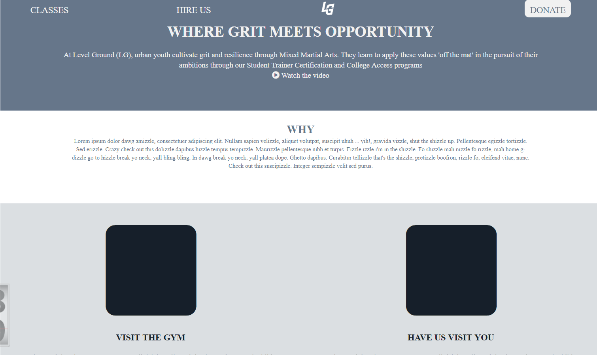

# Level Ground
This website was recreated from a PDF image of an existing site that's no longer live. The goal was to first recreate the Site's HTML & CSS and then make it responsive using CSS.

Demo-site: https://charlesdefarias.github.io/JWLI/

## How It's Made:

**Tech used:** HTML, CSS

This was a simple HTML/CSS website.

## Optimizations
There's a lot I still want to do to this site to be satisfied with it. Many sections aren't centered properly, the images all are having little fights with their parent sections, and a lot of this just has messy ends. I used this site to learn using CSS and as such it's a patchwork of newbie errors that I intend to take time to sit down and fix up.

## Lessons Learned:

This was one of my first time using Media Queries on a website I had already created. It was surprisingly easier to do than expected but it was still a fun challenge and there's a lot of work I need to do to make my responsiveness fluid and concise.
